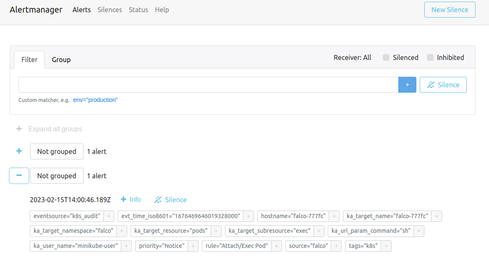

# gVisor + Falco
## gVisor
### Create a minikube cluster and configure it
```sh
$ ./init.sh -o minikube
```

### Create resources for gVisor
```sh
$ ./init.sh -o gvisor
```

### Show kernel release
```sh
# gvisor Kubernetes
$ kubectl exec gvisor -- uname -r
4.4.0

# Non-gvisor Kubernetes Pod
$ kubectl exec non-gvisor -- uname -r
5.10.57

# On Host
$ minikube -p falco ssh -- uname -r
5.10.57
```

## Falco
*  Deploy Falco and dependencies
```sh
$ ./init.sh -o falco
```

### Checks thats all pods runnings
```sh
$ kubectl get po -A
NAMESPACE               NAME                                                        READY   STATUS      RESTARTS        AGE
falco                   falco-777fc                                                 2/2     Running     0               10m
falco                   falcosidekick-79c4f5d657-ld8k2                              1/1     Running     0               6m28s
falco                   falcosidekick-ui-5b74f84cbd-9sj2m                           1/1     Running     0               6m28s
falco                   falcosidekick-ui-redis-0                                    1/1     Running     0               6m28s
ingress-nginx           ingress-nginx-admission-create-rt4rq                        0/1     Completed   0               20m
ingress-nginx           ingress-nginx-admission-patch-bvc2d                         0/1     Completed   0               20m
ingress-nginx           ingress-nginx-controller-5959f988fd-jc4r8                   1/1     Running     0               20m
kube-prometheus-stack   alertmanager-kube-prometheus-stack-alertmanager-0           2/2     Running     0               8m15s
kube-prometheus-stack   kube-prometheus-stack-kube-state-metrics-5b975875c5-59ht4   1/1     Running     0               8m42s
kube-prometheus-stack   kube-prometheus-stack-operator-9cdd545-x5sqf                1/1     Running     0               8m42s
kube-prometheus-stack   kube-prometheus-stack-prometheus-node-exporter-vhpfd        1/1     Running     0               8m42s
kube-prometheus-stack   prometheus-kube-prometheus-stack-prometheus-0               2/2     Running     0               8m15s
kube-system             coredns-565d847f94-4n9kj                                    1/1     Running     0               20m
kube-system             etcd-falco                                                  1/1     Running     0               20m
kube-system             kube-apiserver-falco                                        1/1     Running     0               20m
kube-system             kube-controller-manager-falco                               1/1     Running     0               20m
kube-system             kube-proxy-fn66c                                            1/1     Running     0               20m
kube-system             kube-scheduler-falco                                        1/1     Running     0               20m
kube-system             storage-provisioner                                         1/1     Running     0               20m
```

### Checks audit logs from api-server
```sh
$ kubectl -n kube-system logs kube-apiserver-falco | grep audit
...
{"kind":"Event","apiVersion":"audit.k8s.io/v1","level":"Metadata","auditID":"218b1c57-b083-4edf-955d-f97b5b79ed9b","stage":"ResponseStarted","requestURI":"/api/v1/namespaces/kube-system/pods/kube-apiserver-falco/log?container=kube-apiserver","verb":"get","user":{"username":"minikube-user","groups":["system:masters","system:authenticated"]},"sourceIPs":["192.168.59.1"],"userAgent":"kubectl/v1.25.0 (linux/amd64) kubernetes/a866cbe","objectRef":{"resource":"pods","namespace":"kube-system","name":"kube-apiserver-falco","apiVersion":"v1","subresource":"log"},"responseStatus":{"metadata":{},"code":200},"requestReceivedTimestamp":"2023-02-15T11:51:31.696947Z","stageTimestamp":"2023-02-15T11:51:31.704921Z","annotations":{"authorization.k8s.io/decision":"allow","authorization.k8s.io/reason":""}}
{"kind":"Event","apiVersion":"audit.k8s.io/v1","level":"Metadata","auditID":"adf18f88-edb3-4250-8cac-dfc70a3b381c","stage":"ResponseComplete","requestURI":"/readyz","verb":"get","user":{"username":"system:anonymous","groups":["system:unauthenticated"]},"sourceIPs":["192.168.59.112"],"userAgent":"kube-probe/1.25","responseStatus":{"metadata":{},"code":200},"requestReceivedTimestamp":"2023-02-15T11:51:32.122992Z","stageTimestamp":"2023-02-15T11:51:32.124574Z","annotations":{"authorization.k8s.io/decision":"allow","authorization.k8s.io/reason":"RBAC: allowed by ClusterRoleBinding \"system:public-info-viewer\" of ClusterRole \"system:public-info-viewer\" to Group \"system:unauthenticated\""}}
{"kind":"Event","apiVersion":"audit.k8s.io/v1","level":"Request","auditID":"e3b8e4fb-c641-483f-87c2-4cb97956cb4d","stage":"ResponseComplete","requestURI":"/api/v1/namespaces/kube-system/endpoints/k8s.io-minikube-hostpath","verb":"get","user":{"username":"system:serviceaccount:kube-system:storage-provisioner","uid":"42993bd1-2963-45f6-b67c-e521deae683f","groups":["system:serviceaccounts","system:serviceaccounts:kube-system","system:authenticated"],"extra":{"authentication.kubernetes.io/pod-name":["storage-provisioner"],"authentication.kubernetes.io/pod-uid":["8b5f570d-d06c-40a8-9f47-8ef2ee2e82a1"]}},"sourceIPs":["10.0.2.15"],"userAgent":"storage-provisioner/v0.0.0 (linux/amd64) kubernetes/$Format","objectRef":{"resource":"endpoints","namespace":"kube-system","name":"k8s.io-minikube-hostpath","apiVersion":"v1"},"responseStatus":{"metadata":{},"code":200},"requestReceivedTimestamp":"2023-02-15T11:51:32.213257Z","stageTimestamp":"2023-02-15T11:51:32.214523Z","annotations":{"authorization.k8s.io/decision":"allow","authorization.k8s.io/reason":"RBAC: allowed by RoleBinding \"system:persistent-volume-provisioner/kube-system\" of Role \"system:persistent-volume-provisioner\" to ServiceAccount \"storage-provisioner/kube-system\""}}
{"kind":"Event","apiVersion":"audit.k8s.io/v1","level":"Request","auditID":"5a74c0b2-04e2-436c-8b4e-19ad4bf5b6a8","stage":"ResponseComplete","requestURI":"/api/v1/namespaces/kube-system/endpoints/k8s.io-minikube-hostpath","verb":"update","user":{"username":"system:serviceaccount:kube-system:storage-provisioner","uid":"42993bd1-2963-45f6-b67c-e521deae683f","groups":["system:serviceaccounts","system:serviceaccounts:kube-system","system:authenticated"],"extra":{"authentication.kubernetes.io/pod-name":["storage-provisioner"],"authentication.kubernetes.io/pod-uid":["8b5f570d-d06c-40a8-9f47-8ef2ee2e82a1"]}},"sourceIPs":["10.0.2.15"],"userAgent":"storage-provisioner/v0.0.0 (linux/amd64) kubernetes/$Format","objectRef":{"resource":"endpoints","namespace":"kube-system","name":"k8s.io-minikube-hostpath","uid":"d88f7ba7-59c0-4865-87de-5290decee3de","apiVersion":"v1","resourceVersion":"2188"},"responseStatus":{"metadata":{},"code":200},"requestObject":{"kind":"Endpoints","apiVersion":"v1","metadata":{"name":"k8s.io-minikube-hostpath","namespace":"kube-system","uid":"d88f7ba7-59c0-4865-87de-5290decee3de","resourceVersion":"2188","creationTimestamp":"2023-02-15T11:29:52Z","annotations":{"control-plane.alpha.kubernetes.io/leader":"{\"holderIdentity\":\"falco_f6e2f777-f517-4391-8bf9-8f4f15808d95\",\"leaseDurationSeconds\":15,\"acquireTime\":\"2023-02-15T11:29:52Z\",\"renewTime\":\"2023-02-15T11:51:32Z\",\"leaderTransitions\":0}"},"managedFields":[{"manager":"storage-provisioner","operation":"Update","apiVersion":"v1","time":"2023-02-15T11:51:30Z","fieldsType":"FieldsV1","fieldsV1":{"f:metadata":{"f:annotations":{".":{},"f:control-plane.alpha.kubernetes.io/leader":{}}}}}]}},"requestReceivedTimestamp":"2023-02-15T11:51:32.215056Z","stageTimestamp":"2023-02-15T11:51:32.217060Z","annotations":{"authorization.k8s.io/decision":"allow","authorization.k8s.io/reason":"RBAC: allowed by RoleBinding \"system:persistent-volume-provisioner/kube-system\" of Role \"system:persistent-volume-provisioner\" to ServiceAccount \"storage-provisioner/kube-system\""}}
...
```

### URLs
```sh
$ kubectl get ing -A
NAMESPACE               NAME                                 CLASS   HOSTS                                    ADDRESS          PORTS   AGE
falco                   falcosidekick-ui                     nginx   falcosidekick-ui.192.168.59.112.nip.io   192.168.59.112   80      133m
kube-prometheus-stack   kube-prometheus-stack-alertmanager   nginx   alertmanager.192.168.59.112.nip.io       192.168.59.112   80      135m
```

### Create a Configmap with secrets keys
```sh
# Create object
$ kubectl apply -f config/falco-configmap.yaml

# Show logs
$ kubectl -n kube-system logs kube-apiserver-falco | grep "my-config"

{"kind":"Event","apiVersion":"audit.k8s.io/v1","level":"RequestResponse","auditID":"39e8b8e6-8aa3-4a6b-a3f6-62abb7268f42","stage":"ResponseComplete","requestURI":"/api/v1/namespaces/default/configmaps?fieldManager=kubectl-client-side-apply\u0026fieldValidation=Strict","verb":"create","user":{"username":"minikube-user","groups":["system:masters","system:authenticated"]},"sourceIPs":["192.168.59.1"],"userAgent":"kubectl/v1.25.0 (linux/amd64) kubernetes/a866cbe","objectRef":{"resource":"configmaps","namespace":"default","name":"my-config","apiVersion":"v1"},"responseStatus":{"metadata":{},"code":201},"requestObject":{"kind":"ConfigMap","apiVersion":"v1","metadata":{"name":"my-config","namespace":"default","creationTimestamp":null,"annotations":{"kubectl.kubernetes.io/last-applied-configuration":"{\"apiVersion\":\"v1\",\"data\":{\"access.properties\":\"aws_access_key_id = MY-ID\\naws_secret_access_key = MY-KEY\\n\",\"ui.properties\":\"color.good=purple\\ncolor.bad=yellow\\nallow.textmode=true\\n\"},\"kind\":\"ConfigMap\",\"metadata\":{\"annotations\":{},\"name\":\"my-config\",\"namespace\":\"default\"}}\n"}},"data":{"access.properties":"aws_access_key_id = MY-ID\naws_secret_access_key = MY-KEY\n","ui.properties":"color.good=purple\ncolor.bad=yellow\nallow.textmode=true\n"}},"responseObject":{"kind":"ConfigMap","apiVersion":"v1","metadata":{"name":"my-config","namespace":"default","uid":"7b3bf5e5-6734-4519-b247-e124c151df92","resourceVersion":"5412","creationTimestamp":"2023-02-15T12:55:41Z","annotations":{"kubectl.kubernetes.io/last-applied-configuration":"{\"apiVersion\":\"v1\",\"data\":{\"access.properties\":\"aws_access_key_id = MY-ID\\naws_secret_access_key = MY-KEY\\n\",\"ui.properties\":\"color.good=purple\\ncolor.bad=yellow\\nallow.textmode=true\\n\"},\"kind\":\"ConfigMap\",\"metadata\":{\"annotations\":{},\"name\":\"my-config\",\"namespace\":\"default\"}}\n"},"managedFields":[{"manager":"kubectl-client-side-apply","operation":"Update","apiVersion":"v1","time":"2023-02-15T12:55:41Z","fieldsType":"FieldsV1","fieldsV1":{"f:data":{".":{},"f:access.properties":{},"f:ui.properties":{}},"f:metadata":{"f:annotations":{".":{},"f:kubectl.kubernetes.io/last-applied-configuration":{}}}}}]},"data":{"access.properties":"aws_access_key_id = MY-ID\naws_secret_access_key = MY-KEY\n","ui.properties":"color.good=purple\ncolor.bad=yellow\nallow.textmode=true\n"}},"requestReceivedTimestamp":"2023-02-15T12:55:41.523238Z","stageTimestamp":"2023-02-15T12:55:41.525607Z","annotations":{"authorization.k8s.io/decision":"allow","authorization.k8s.io/reason":""}}
```


### Exec Pod
```sh
$ kubectl -n falco exec -it daemonsets/falco -- bash
Defaulted container "falco" out of: falco, falcoctl-artifact-follow, falcoctl-artifact-install (init)
root@falco-777fc:/#  
```



